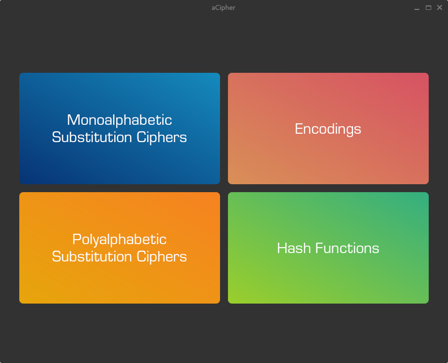

# This repository is synced
# Pythcryptor
Used for transforming text or (in the future) file inputs into encoded or ciphered outputs.

## Flatpak
Planned

## Preview

## License
[GLPv3](https://www.qt.io/licensing/open-source-lgpl-obligations)

tl;dr "community edition" QT binding. 
I just want to practice writing an app in QT that would replace an app I use from FlatHub that is EoL.

## Misc
GitFlow, planned CI/CD and PR-build. 
All commits to dev/main are squashed.
