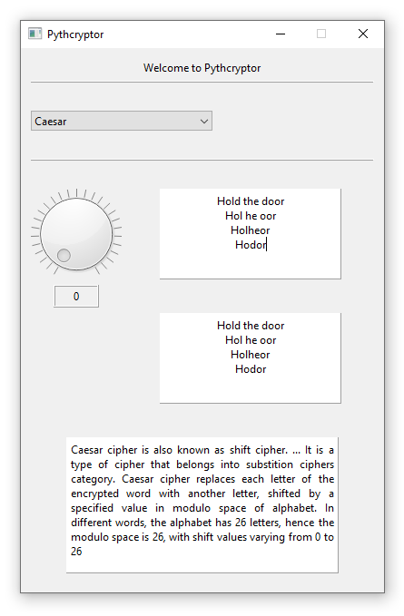

# This repository is synced
# Pythcryptor

Program for quick encryption and decryption of simple data. My first GUI program not written with C#.

It is written using PySide6, manually, without QCreator or QtQuick.

## Purpose

I plan on implementing some basic ciphers, at least the ones I got to know during my studies.

Basically a project merging my minor idea of a cryptography notebook with a handy implementation for my own use.

## Preview

